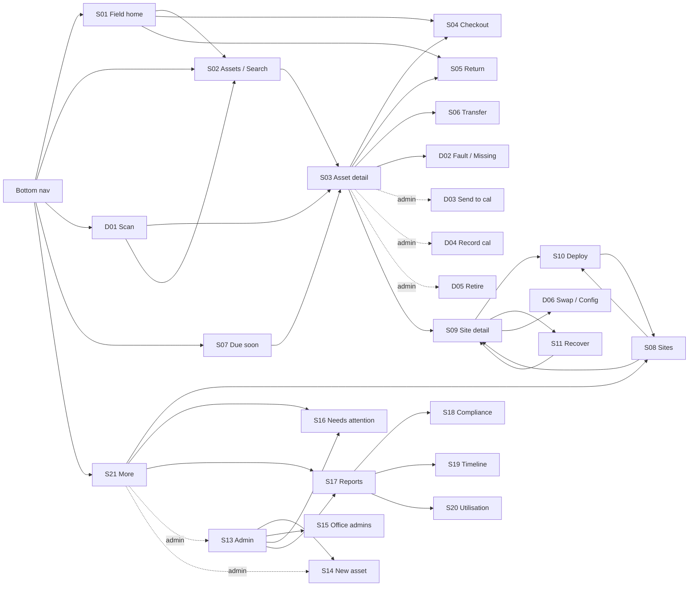

# 12 — UI specification (for design tooling)

**Purpose.** Enough detail to rebuild every screen of the Englobe AMS web application in a design tool
(Figma, Claude Design, Penpot, Sketch…) as frames, components and variants — without reading code.

**Source of truth.** This document was derived on 2026-09-02 from the built app under `app/src/`
(281 tests passing) and from `docs/02-app.md`. Where the two disagreed, the built app won and the
difference is called out in § 10. All copy is quoted verbatim from `app/src/i18n/en.json`; the key
is shown in `code` so a designer can request a wording change against one file.

**Amended 2026-09-03 (rule 13).** The working tree ran ahead of § 3.1 / § 3.2 / G-24's four-variable
brand isolation. Those deviations are now the specified Field IA and token layer — decision **D3**
in `docs/08-decisions.md`. `docs/mockups/ams-ui/` (GOVERN, desktop 1440×900 with a 232 px rail) is
a **proposal**, not an amendment of this file.

**What this is not.** It is not a visual redesign brief. The app is Fluent UI v9 with an Englobe green
brand ramp and a documented token layer in `app/src/styles/ams.css` (§ 2.4). § 10 lists the places
where a designer's judgement is explicitly invited; everything else is a constraint to honour.

---

## 0. How to use this in a design tool

| Convention | Rule |
|---|---|
| Artboard | Mobile 390 × 844 (iPhone-class); desktop 1440 × 900. One artboard per screen state, per surface it appears on (§ 1) |
| Frame naming | `S03 Asset detail / default`, `S03 Asset detail / retired`, `S04 Checkout / refused`. IDs from § 5 |
| Components | Name after the Fluent v9 component they map to (`Button/primary/large`, `Badge/filled/success`) so developers can map 1:1 |
| Shared components | Build § 4 first as reusable components with variants, then compose screens from them |
| Copy | Paste strings exactly as quoted. Keep `{placeholder}` tokens visible in the design as e.g. `{assetId}` → `DL-UM-16984` sample text |
| Dark mode | Build one light set. Dark is a token swap (§ 2.4) — a second theme, not a second design |
| Sample data | Use real-shaped IDs: `DL-UM-16984`, `GEO-V12-30220`, `SLM-S50-13595`, `DST-0246`, `TMP-0031`. Offices: Ottawa, Toronto, Sudbury, SWO. Project numbers look like `02208928`. **The scheme is not a design choice** — rule 6 makes the canonical Asset ID the identity, so a mockup must not invent a second shape. Fleet coverage should include a total station and a vehicle, which the first mockup's sample set omitted *(hardened 2026-09-03 after `docs/20-mockup-review.md` M2)* |

---

## 1. Fixed constraints

These are decided in `CLAUDE.md` and `docs/02-app.md`. Do not re-litigate in the design.

| Constraint | Value |
|---|---|
| Product surfaces | **Three surfaces, one coherent app** *(decided 2026-09-03)*. **Field** is the deliberate mobile slice: home, find/scan, trimmed asset detail, checkout, return, transfer, report fault, deploy/recover, reservations and offline attention. **Desk** is the full-width operational and read-heavy experience. **Console** is the desktop administration and data-management workspace. Console is table-first and is not Desk with extra buttons. Which routes belong to each surface is fixed in `docs/02-app.md` § Surfaces |
| Design width | Mobile **390 px**, content capped 480 px, centred. Desktop **≥ 768 px**, two-pane above 900 px. G-01 is resolved and inverted: the desktop layout is not optional polish on a canonical phone design, it is where most of the function lives |
| Component library | Fluent UI v9 (`@fluentui/react-components`), web theme. Icons: Fluent UI System Icons, *Regular* weight |
| Theme | `webLightTheme` / `webDarkTheme`. Dark follows the OS; there is no in-app toggle |
| Language | English only (Phase 1). French is planned — leave ~30 % horizontal slack in labels and buttons |
| Copy | Every visible string comes from `en.json`. No copy is invented in the design |
| Reference data | Manufacturer, model, type, location, project are **always picked from a list**, never typed |
| Actions | Only the actions the status state machine allows are offered (§ 5.3). Both the app and the server refuse the rest |
| Writes | Users never edit an asset's status/location/custodian/project directly. Every change is a *transaction* with a confirmation screen |
| Secured fields | SIM ICCID, phone number, static IP are visible to Office Admin and System Owner only |

---

## 2. Foundations

### 2.1 Canvas and app shell

```
┌────────────────────────────────────────────┐  ← 390 wide (max 480, centred)
│ Header  56 px  Background1, 1 px Stroke2   │
│  "Englobe AMS" (Title3)   [dev role picker]│
├────────────────────────────────────────────┤
│ Main   flex 1, scrolls vertically          │
│        Background2                         │
│        page padding 12 or 16 px            │
│                                            │
├────────────────────────────────────────────┤
│ BottomNav  ~56 px + safe-area inset        │
│  Background1, 1 px Stroke2 top, sticky     │
└────────────────────────────────────────────┘
```

- Header right slot holds a **dev-only** role picker (`RoleSwitcher`). It is deleted in production. Design
  the production header with the right slot empty or propose a use for it (G-02).
- Main is the only scroll region. Header and bottom nav never scroll.
- Page content sits directly on Background2. Grouped content uses **cards** (Background1, radius 4–8 px)
  or **list rows** separated by 1 px Stroke2 lines.

### 2.2 Spacing scale

| Token | px | Where |
|---|---|---|
| xs | 4 | Icon-to-text gaps, stacked text lines inside a row |
| s | 8 | Gap between controls in a row, between fields in a form, row vertical padding |
| m | 12 | Page padding on list screens and reports, card padding, row horizontal padding |
| l | 16 | Page padding on form/detail screens, gap between cards |
| xl | 24 | Spinner/empty-state inset |

Row height for tappable list items: **≥ 44 px** (AssetRow is ~74 px).

### 2.3 Typography

Fluent v9 web theme. Font stack: `'Segoe UI', 'Segoe UI Web (West European)', -apple-system,
BlinkMacSystemFont, Roboto, 'Helvetica Neue', sans-serif`. Monospace: `Consolas, 'Courier New',
Courier, monospace`.

| Fluent style | Size / line | Weight | Used for |
|---|---|---|---|
| Title2 | 32 / 40 | 600 | Screen titles ("Checkout", "Reports"). **Asset ID and site name titles use Title2 in monospace** |
| Title3 | 24 / 32 | 600 | App name in header, card titles on Admin and Reports |
| Body1 (`Text`) | 14 / 20 | 400 | Default text, field values |
| Body1 semibold | 14 / 20 | 600 | Section labels, row primary text, field values in info cards |
| Caption1 (`Text size=200`) | 12 / 16 | 400 | Row secondary text, hints, metadata, group headers, dates |
| Caption2 (`Text size=100`) | 10 / 14 | 400 | Fine print (e.g. "Rejected submissions are never discarded") |
| Nav label | 11 / auto | 400 | Bottom nav labels |
| Monospace bold | 14 / 20 | 700 | Asset IDs in rows and carts. Asset IDs are **always monospace** |

### 2.4 Colour tokens

Values are from `@fluentui/tokens` as installed. Use the token names in the design system; hex is for
pixel-matching only.

| Token | Light | Dark | Used for |
|---|---|---|---|
| `colorNeutralBackground1` | `#ffffff` | `#292929` | Header, bottom nav, cards, selected row |
| `colorNeutralBackground2` | `#fafafa` | `#1f1f1f` | Page background |
| `colorNeutralBackground3` | `#f5f5f5` | `#141414` | Group/section header bars, range-start callout, proportion-bar track |
| `colorNeutralBackground5` | `#f0f0f0` | — | Informative badge background |
| `colorNeutralStroke1` | `#d1d1d1` | — | Primary button border on Deploy submit |
| `colorNeutralStroke2` | `#e0e0e0` | `#525252` | Row separators, header/nav borders, list frames |
| `colorNeutralForeground1` | `#242424` | `#ffffff` | Body text |
| `colorNeutralForeground3` | `#616161` | `#adadad` | Secondary text, labels, inactive nav, hints |
| `colorBrandForeground1` | `#0f6cbd` | `#479ef5` | Active nav item, timeline attach/detach lines |
| `colorBrandBackground` | `#0f6cbd` | `#115ea3` | Primary buttons, brand badge |
| `colorPaletteRedForeground1` | `#bc2f32` | `#e37d80` | Overdue calibration text, rejection reason text |
| `colorPaletteGreenForeground1` | `#0e700e` | `#54b054` | "Saved." confirmation text |
| `colorPaletteMarigoldForeground1` | `#d39300` | `#f2c661` | Warning icon on temporary/incomplete Asset IDs |
| `colorPaletteGreenBackground3` | `#107c10` | `#107c10` | Utilisation bar — Available segment; success badge |
| `colorPaletteBlueBackground2` | `#a9d3f2` | — | Utilisation bar — In use segment |
| `colorPaletteRedBackground2` | `#f1bbbc` | — | Utilisation bar — Out of service segment |

Brand ramp: Englobe green `#14713a` remaps Fluent `colorBrand*` (G-24 / D1, option A). Neutrals and
status colours are **not** left as stock Fluent defaults.

**Token layer (D3, 2026-09-03).** G-24 / D1 isolated brand to four CSS variables
(`--brandFg` / `--brandBg` / `--brandTint` / `--brandOn`, formerly `--brandFgOn`). The working tree
widened that: `app/src/styles/ams.css` declares ~40 custom properties (canvas, strokes, foregrounds,
status fill/text pairs, radii, header/nav heights) and `app/src/theme.ts` overrides Fluent's
`colorNeutral*` ramp so leftover Fluent defaults do not fight the mockup. Brand is still Englobe
green on Fluent v9 / Segoe UI. The four brand variables remain the place the hex is swapped; they
are no longer the *only* tokens the app owns. G-03 is implemented.

### 2.5 Status colours — the `StatusPill`

`Badge` with `appearance="filled"`, `shape="rounded"`, medium size (20 px tall, 12 px semibold text).
Mapping is fixed in `components/StatusPill.tsx`:

| Asset status | Label | Badge colour | Light background / text |
|---|---|---|---|
| Available | Available | `success` | `#107c10` / white |
| CheckedOut | Checked out | `informative` | `#f0f0f0` / `#616161` |
| Deployed | Deployed | `informative` | `#f0f0f0` / `#616161` |
| InCalibration | In calibration | `warning` | `#fde300` (yellow) / `#242424` |
| NeedsRepair | Needs repair | `danger` | `#d13438` / white |
| Missing | Missing | `danger` | `#d13438` / white |
| Retired | Retired | `subtle` | `#ffffff` / `#242424` |

Note for the designer: Checked out and Deployed are visually identical grey pills today, and
Needs repair and Missing are identical red pills. Distinguishing them is invited (G-04).

Other badges in the app (same Fluent semantics):

| Use | Badge |
|---|---|
| Count on a section header (overdue / due / unknown / pending / gaps) | `danger` / `warning` / `subtle` / brand default / `danger` |
| "Retired" lifecycle badge next to a status pill | `subtle` |
| "Temporary tag — needs completion" | `warning` |
| "OVERDUE" under the Now card | `danger` |
| "Primary" on a cart line | brand default (`#0f6cbd` / white) |
| "Current installation" on a deployment row | `informative` |
| "closed" on a past installation | `appearance="tint"` neutral |
| Fleet total / Available total in reports | `size="large"` brand / `success` |
| Lowest-availability percentage | `danger` if < 20 %, else `warning` |

### 2.6 Iconography

Fluent UI System Icons, Regular weight, 20 px in buttons, 14 px inline in text.

| Icon | Where |
|---|---|
| Home | Bottom nav "Home" |
| Assets (grid) | Bottom nav "Assets"; search input prefix |
| Scan (viewfinder) | Bottom nav "Scan" (opens D01; not a route) |
| Calendar | Bottom nav "Due soon"; inline overdue marker on AssetRow |
| More (three dots) | Bottom nav "More" |
| `Location` | "Deploy" on Sites; "Use device location" |
| `Camera` | Scan on Search / Home when not using the nav Scan action |
| `Delete` | Remove-from-cart icon button (subtle, small) |
| `Warning` | Inline marker on temporary / prefix-only Asset IDs (marigold) |

### 2.7 Controls

| Control | Fluent component | Size used | Notes |
|---|---|---|---|
| Primary action (Submit, Save) | `Button appearance="primary" size="large"` | 40 px tall, full width on forms | Label swaps to "Submitting…" while busy; disabled when cart empty |
| Secondary / row action | `Button appearance="secondary"` | 32 px | Asset detail actions, "Add", "Retry" |
| Destructive (Retire) | `Button appearance="outline"` | 32 px | Not red today (G-05) |
| Icon-only | `Button appearance="subtle" size="small" icon` | 24 px | Needs `aria-label` |
| Text link button | `Button appearance="transparent"` | — | "Back", "All" (clear range) |
| Toggle filter chip | `ToggleButton size="small"` | 24 px | Search quick filters |
| Text input | `Input` | 32 px | With optional `contentBefore` icon |
| Multi-line | `Textarea rows=2–3` | — | Notes |
| Select (native) | `Select` | 32 px | Most pickers (project, location, model, condition, role) |
| Dropdown (Fluent) | `Dropdown` / `Option` | small or medium | Horizon, period, report filters, role switcher |
| Date | `Input type="date"` | 32 px | Native picker |
| Checkbox / Switch | `Checkbox`, `Switch` | — | "Currently installed only"; include/leave-behind per component |
| Tabs | `TabList` / `Tab` | — | History / Calibration; Swap / Change configuration |
| Banner | `MessageBar intent=success/warning/error/info` | — | See § 6 |
| Modal | `Dialog` → `DialogSurface` → `DialogBody` (Title, Content, Actions) | — | Actions: secondary "Cancel" left, primary right |
| Loading | `Spinner label="Loading…"` | — | Centred, 24 px inset |
| Field wrapper | `Field label required hint` | — | Label above control; required shows Fluent asterisk |

---

## 3. Information architecture

### 3.1 Bottom navigation

**Amended 2026-09-03 (D3).** Five items for every role — the working tree, not the previous six-item
Search / Cal Due / Checkout / Return / Sites / Admin bar. Checkout, Return, Sites and Admin are
reached from S01 quick actions or from S21 More. Active item is brand green (`--brandFg`). Scan is
an **action** (opens D01), not a route.

| Order | Label (`key`) | Route | Roles |
|---|---|---|---|
| 1 | Home (`nav.home`) | `/` | all |
| 2 | Assets (`nav.assets`) | `/search` | all |
| 3 | Scan (`nav.scan`) | — (D01) | all |
| 4 | Due soon (`nav.dueSoon`) | `/calibration` | all |
| 5 | More (`nav.more`) | `/more` | all; Admin / New asset rows on S21 are admin-only |

A pending-sync count badges More when the offline queue is non-empty (FR-027 partial: cache age and
last successful sync are still not displayed).

Desk / Console left-rail IA, GOVERN, and the 1440×900 / 232 px shell in `docs/mockups/ams-ui/` are a
**proposal** in § 13 — not this section, and not authorization to build feature 011 screens.

### 3.2 Screen inventory

| ID | Screen | Route | Roles | Reached from | Wireframe |
|---|---|---|---|---|---|
| S01 | Field home | `/` | all | nav | § 5.1 (D2) |
| S02 | Search / Assets | `/search` | all | nav, S01 Search action, D01 | § 5.1 (search layout, moved off `/`) |
| S21 | More | `/more` | all | nav, header avatar | § 5.22 |
| D01 | Scan a tag (dialog) | — | all | nav Scan, S01 Scan, S02 Scan | § 5.2 |
| S03 | Asset detail | `/asset/:assetId` | all | any AssetRow, scan | § 5.3 |
| D02 | Report fault / Mark missing (notes dialog) | — | all | S03 | § 5.4 |
| D03 | Send to calibration | — | admin | S03 | § 5.4 |
| D04 | Record calibration | — | admin | S03 | § 5.4 |
| D05 | Retire asset | — | admin | S03 | § 5.4 |
| S04 | Checkout | `/checkout?asset=` | all | S01, S03 | § 5.5 |
| S05 | Return | `/return?asset=` | all | S01, S03 | § 5.6 |
| S06 | Transfer | `/transfer?asset=` | all | S03 only | § 5.7 |
| S07 | Calibration due | `/calibration` | all | nav | § 5.8 |
| S08 | Sites | `/sites` | all | S21, after Deploy | § 5.9 |
| S09 | Site detail | `/site/:site` | all | S08, S03 deployment row, after Recover | § 5.10 |
| S10 | Deploy | `/deploy` | all | S08, S09 | § 5.11 |
| S11 | Recover | `/recover/:installationId` | all | S09 | § 5.12 |
| D06 | Swap component / Change configuration | — | all | S09 | § 5.13 |
| S13 | Admin home | `/admin` | admin | S21 | § 5.14 |
| S14 | New asset | `/admin/new-asset` | admin | S13 | § 5.15 |
| S15 | Office administrators | `/admin/office-admins` | admin | S13 | § 5.16 |
| S16 | Needs attention | `/needs-attention` | all | S21, S13 | § 5.17 |
| S17 | Reports home | `/reports` | all | S21, S13 | § 5.18 |
| S18 | Calibration compliance | `/reports/compliance` | all | S17 | § 5.19 |
| S19 | Asset timeline | `/reports/timeline/:assetId` | all | S17 | § 5.20 |
| S20 | Utilisation | `/reports/utilisation` | all | S17 | § 5.21 |
| X01 | Confirmation state | — | — | after any submit | § 6 |
| X02 | Queued-offline state | — | — | after submit with no connection | § 6 |

§ 13 records a **proposal** (Desk/Console rails, GOVERN, reservations, category browse). It is not
an adopted screen inventory and does not authorize building those families ahead of feature 011.

### 3.3 Navigation map



### 3.4 Roles

| Role | Sees | Notes |
|---|---|---|
| Field User | Everything except Admin / New asset rows on S21, admin-only actions on S03, and secured SIM fields | Demo persona: "Sam Tech (demo Field User)", Ottawa |
| Office Admin | + Admin and New asset on S21, S13–S15, Send to calibration / Record calibration / Retire, SIM fields | Demo: "Alex Admin (demo Office Admin)" |
| System Owner | Same UI as Office Admin | Demo: "System Owner (demo)" |
| Report Reader | API role exists; **not** offered in the client's role switcher (FR-052 remainder) | Demo identity `reader@englobecorp.com` is server-only |

The header shows an avatar that opens S21 (G-02 partially answered). The production header still has
no signed-in name or home office. The role switcher on S21 is **dev-only**.

---

## 4. Shared components

Build these first. Each is a single React component today, so a single design component with
variants maps cleanly.

### C1 — StatusPill
See § 2.5. Variants: the seven statuses.

### C2 — AssetRow  (`components/AssetRow.tsx`)

The universal list item. Tappable (opens S03). ~74 px tall, 10 px vertical / 12 px horizontal padding,
1 px Stroke2 bottom border, no card.

```
┌──────────────────────────────────────────────┐
│ DL-UM-16984 ⚠                    [Available] │  line 1: Asset ID mono bold · warning icon only if TMP-/prefix-only · StatusPill right
│ Instantel Micromate                           │  line 2: "{manufacturer} {model}" Caption1
│ Ottawa                        tech@englobe…   │  line 3: current location (fallback home office, "—") left · custodian right, Foreground3
│ 🕑 12 days overdue                            │  line 4: only when nextcaldue < today, red, CalendarClock icon; text is
└──────────────────────────────────────────────┘          "Calibration overdue" or "{days} days overdue"
```

Variants: default · overdue · incomplete-id (⚠) · overdue+incomplete. Long custodian UPNs truncate.

### C3 — Cart line (Checkout / Return / Transfer / Deploy component)

```
┌──────────────────────────────────────────────┐
│ DL-UM-16984 [Primary]        [Available] [🗑] │
│ Instantel Micromate                           │
└──────────────────────────────────────────────┘
```
- Left: Asset ID mono semibold, optional "Primary" brand badge, model on line 2.
- Right: StatusPill (Checkout only) and a subtle small Delete icon button labelled "Remove" (`cart.remove`).
- Return variant replaces the pill with a **Condition** `Select` (Good / Damaged / Needs service).
- Deploy component variant replaces the pill with **Role** `Select` and, for Sensor1–4, an
  **Orientation** `Select` (H, V, BH, N, E, S, W) marked required.
- Transfer variant is a single line: Asset ID mono + Delete, 6 px padding.

### C4 — Section header with count

Full-width bar, Background3, 8 px vertical / 16 px horizontal padding. Left: label semibold. Right:
count `Badge` (colour by tone). Used on S07, S16 and Search result groups (Search uses Caption1
semibold and a plain count, no badge).

### C5 — Label / value field and the 2-column info card

```
┌ Background1, radius 8, padding 12 ─────────────┐
│ Location            Home office                 │  label Caption1 Foreground3
│ Ottawa              Ottawa                      │  value Body1 semibold (red if danger)
│ Custodian           Project                     │
│ —                   02208928                    │
│ Parent asset        Next calibration due        │
│ —                   2026-03-01                  │
└─────────────────────────────────────────────────┘
```
Missing values render as an em dash. Used on S03 (Now card) and S09 (installation facts).

### C6 — MessageBar

Fluent `MessageBar` with `MessageBarBody`. Full width of the content column.

| Intent | Used for |
|---|---|
| `error` | Refusals and validation ("A project is required.", "{assetId} is {status}, held by {custodian} — can't add it.") |
| `warning` | Offline banner on Search; queued-offline result; leave-behind prompt on Recover |
| `success` | Confirmation after a submit; "Every office has an administrator." |
| `info` | "Restored your unfinished deployment form." |

### C7 — Dialog

`DialogSurface` centred, default Fluent width (~600 max, fits 390 with margins). Title, content
stack with 8 px gaps, actions row right-aligned: secondary **Cancel** then primary **Confirm / Save /
Retire / Resolve**. Errors show as an `error` MessageBar at the top of the content.

### C8 — Confirmation and Queued states (X01 / X02)

After a successful submit the whole form is replaced by:

```
┌──────────────────────────────────────────────┐
│ ✓ Checkout TXN-000123 recorded. State updates│  MessageBar success (or warning when queued)
│   within ~1 min.                              │
│ [ Back ]                                      │  Button primary — returns to the empty form
└──────────────────────────────────────────────┘
```
Queued variant copy (`offline.submissionQueued`): "No connection — queued. It will send
automatically when you're back online." Deploy's button goes to Sites; Recover's goes to the site;
New asset's goes to Admin. See G-07 for the inconsistent button labels.

### C9 — Loading and empty

- Loading: centred `Spinner` with "Loading…" (`common.loading`), 24 px margin.
- Empty: a single Foreground3 line, e.g. "Add assets by scanning or searching." (`cart.empty`),
  "No sites yet." (`site.listEmpty`), "Nothing needs attention." (`offline.needsAttention.empty`),
  "No history yet." (`asset.history.empty`), "None" (`common.none`).
- Search with no match is **not** an empty state: it shows "Nothing matched "{query}"." plus a
  secondary button "Search by model instead" (`search.searchByModelInstead`).

### C10 — Pending sync indicator (`offline.pendingBadge` = "Pending sync")

Required by spec FR-040 on every affected asset. The string and data flag exist; the inline badge is
**not yet placed** on AssetRow or S03 (see G-08). Design it as a small `warning`-tone badge next to
the StatusPill.

### C11 — Add-by-ID row

```
[ Search Asset ID, serial, or model…            ] [ Add ]
```
Input flex 1 + primary button. Enter key also adds. Error appears beneath as an `error` MessageBar.
Used on S04, S06, S10 (twice). The Deploy primary-logger picker reuses the "Add component" label
on its button (G-07).

### C12 — Proportion bar (S20)

8 px tall, radius 4, track Background3, segments left-to-right: Available (green 3) · In use
(blue 2) · Out of service (red 2). Percentage of Available shown right-aligned above in Foreground3.
When history is insufficient the bar is replaced by "Not enough history yet for a reliable figure."

---

## 5. Screens

Every screen below lists: route, roles, which acceptance question it answers (from `docs/00-brief.md`
Q1–Q7), layout top to bottom, elements with exact copy, behaviour, and states.

### 5.1 — S01 Search / Home

> **SUPERSEDED 2026-09-03 by decision D2.** The Field home is no longer search. It is now a
> greeting and custody count, three quick actions (Scan / Check out / Return), calibration
> due-soon and overdue counts, recent activity, and the user's own equipment — the layout of
> `docs/mockups/review-ref/Assets Console Mobile.dc.html`, built in Fluent + Englobe green per
> **G-24 = A**, not in that file's teal palette. Search keeps its own route at `/search`, reached
> from the home's Search action and from the scan flow. Implemented in
> `app/src/features/home/FieldHomePage.tsx`; the decisions it makes are pure functions in
> `homeModel.ts` and are tested in `app/tests/features/home.test.ts`.
>
> The section below describes the previous search-first home and is kept as the record of what
> changed, not as an instruction.


Route `/` · all roles · answers Q1, Q2, Q3, Q4 (via filters), Q5 (via filter)

```
┌────────────────────────────────────────────────┐
│ ⚠ Showing cached data from 14:02:11.           │  only when offline (MessageBar warning)
│ ┌🔍 Search Asset ID, serial, or model… ┐ [📷 Scan]│  padding 12, gap 8
│ (My equipment) (Available here) (Cal due ≤ 30d)│  ToggleButton small ×3, wrap, padding 0 12 8
│                                                │
│ DataLogger                                  12 │  group header: Background3, 6×12 padding
│ ─ AssetRow ─────────────────────────────────── │
│ ─ AssetRow ─────────────────────────────────── │
│ Geophone                                     4 │
│ ─ AssetRow ─────────────────────────────────── │
└────────────────────────────────────────────────┘
```

| Element | Component | Copy | Behaviour |
|---|---|---|---|
| Offline banner | MessageBar warning | `search.cached` "Showing cached data from {time}." | Shown while `navigator.onLine` is false |
| Search box | Input, Search icon prefix | placeholder `search.placeholder` "Search Asset ID, serial, or model…" | Debounced 250 ms; searches from **3 characters**; typing clears any active filter |
| Scan | Button secondary, Camera icon | `search.scan` "Scan" | Opens D01 |
| Quick filters | ToggleButton small ×3 | `search.filter.myEquipment` "My equipment" · `search.filter.availableHere` "Available here" · `search.filter.calDue30` "Cal due ≤ 30d" | Mutually exclusive; tapping the active one clears it. My equipment = custodian is me. Available here = Available at my home office. Cal due = next cal due within 30 days |
| Hint | Text Foreground3 | `search.minChars` "Type at least 3 characters to search." | 1–2 characters typed, no filter |
| Results | Grouped list | group label = equipment type (raw enum e.g. "DataLogger"), count right | Groups in order of first appearance; each row is C2 |
| No results | Text + Button secondary | `search.noResults` "Nothing matched "{query}"." · `search.searchByModelInstead` "Search by model instead" | Button re-searches with the first word only |

States: idle (nothing typed) · hint · loading (Spinner) · results · no-results · offline · filter-active.
Scan resolution (D01) can land here with the results pre-filtered to the shared-serial matches and
the search box pre-filled with the scanned code.

Design note: group labels are raw enum names ("DataLogger", "SoundLevelMeter"). Humanising them is
invited (G-09).

### 5.2 — D01 Scan a tag (dialog)

The local development scanner is a typed stand-in. Design the production **browser-camera version**:
full-screen viewfinder, permission and unavailable states, torch toggle where supported,
manual-entry fallback, and the outcomes below.

| Element | Copy (hard-coded today, not in `en.json`) |
|---|---|
| Title | "Scan a tag" |
| Body | Development-only explanation that camera scanning is unavailable; offer typed or pasted code through the same resolution path |
| Field | label "Asset ID or serial" — Input, autofocus, Enter submits |
| Actions | Cancel (secondary) · **Resolve** (primary, disabled while empty) |

Resolution rule after a code is read:
1. Exact Asset ID match → open S03.
2. Bare serial matching exactly one asset → open S03.
3. Bare serial matching several assets (e.g. logger and geophone sharing `UM16984`) → return to S01
   showing only those rows so the user picks. Copy available: `asset.disambiguate` "That serial
   matches more than one asset — pick one." (string exists, not rendered today — G-10).
4. Unknown → S01 with the search box pre-filled with the code.

### 5.3 — S03 Asset detail

Route `/asset/:assetId` · all roles · answers Q2, Q3, Q7 (History tab)

```
┌────────────────────────────────────────────────┐  padding 12, gap 12
│ DL-UM-16984 [Available] [Retired] [Temporary…] │  Title2 mono · StatusPill · lifecycle badge (subtle) · warning badge — wrap
│ Instantel Micromate · DataLogger               │  Text 14
│ ┌ info card (C5) ──────────────────────────┐   │
│ │ Location          Home office            │   │
│ │ Custodian         Project                │   │
│ │ Parent asset      Next calibration due   │   │  due date red when past; "Unknown" when null
│ └──────────────────────────────────────────┘   │
│ [OVERDUE]                                      │  danger badge, only when overdue
│ Sites                                          │  only if the asset has ever been deployed
│  337 Power St — 02208928 [Current installation]│  tappable → S09
│  Sensor1 · V · 2026-05-02 → 2026-06-11         │  Caption1 Foreground3: role · orientation · dates
│ [Checkout] [Transfer] [Report fault] [Mark missing]   │  actions — wrap, gap 8, secondary buttons
│ [Send to calibration] [Record calibration] [Retire]   │  admin only; Retire is outline
│ ┌ History ┐ Calibration                        │  TabList
│ 2026-05-02, 2:01 PM — Checkout                 │  Caption1 semibold
│ Available → CheckedOut · to tech@… · project 02208928 │
│ by tech@englobecorp.com                        │  Foreground3
│ ───────────────────────────────────────────    │
│ Notes                                          │  only when notes exist; pre-wrap
└────────────────────────────────────────────────┘
```

**Header badges**

| Badge | When | Copy |
|---|---|---|
| StatusPill | always | § 2.5 |
| Retired | lifecycle = Retired | `asset.retired` "Retired" (subtle) |
| Temporary tag | ID is `TMP-…` or ends with `-` | `asset.temporaryTag` "Temporary tag — needs completion" (warning) |

**Now card** — labels `asset.location` "Location", `asset.homeOffice` "Home office",
`asset.custodian` "Custodian", `asset.project` "Project", `asset.parent` "Parent asset",
`asset.nextCalDue` "Next calibration due". A CheckedOut asset with no custodian shows
`asset.noCustodian` "Unknown — not yet returned in the pilot sweep" (migration artefact).
A heading string `asset.now` "Now" exists but is not rendered.

**Not shown today but specified**: `asset.children` "Attached items" (open Component/Kit children),
`asset.lastCalDate` "Last calibrated", and for Office Admin+ the SIM fields (ICCID, phone number,
static IP, carrier). See G-11.

**Actions** — rendered only when valid from the current status. A tooltip repeats the label.
`docs/02-app.md` asked for *disabled with a reason tooltip* (`asset.actions.notAllowed` "Not available
from {status}" exists); the build *hides* them instead (G-12). The matrix:

| Status ↓ / Action → | Checkout | Return | Transfer | Report fault | Mark missing | Mark found | Repair complete | Send to calibration (A) | Record calibration (A) | Retire (A) |
|---|---|---|---|---|---|---|---|---|---|---|
| Available | ✓ | | ✓ | ✓ | ✓ | | | ✓ | ✓ | ✓ |
| CheckedOut | | ✓ | ✓ | ✓ | ✓ | | | | ✓ | |
| Deployed | | ✓ | ✓ | ✓ | ✓ | | | | ✓ | |
| InCalibration | | | | ✓ | | | | | ✓ | ✓ |
| NeedsRepair | | | | | | | ✓ | ✓ | ✓ | ✓ |
| Missing | | | | | | ✓ | | | | ✓ |
| Retired | | | | | | | | | | |

(A) = Office Admin / System Owner only. "Record calibration" is offered for any *Active* lifecycle.

Action copy: `asset.actions.checkout` "Checkout" · `.return` "Return" · `.transfer` "Transfer" ·
`.reportFault` "Report fault" · `.markMissing` "Mark missing" · `.markFound` "Mark found" ·
`.completeRepair` "Repair complete" · `.sendToCalibration` "Send to calibration" ·
`.recordCalibration` "Record calibration" · `.retire` "Retire" · `.attachComponent` "Attach component"
(string exists, action not built).

Checkout / Return / Transfer navigate to S04 / S05 / S06 with this asset pre-added. Mark found and
Repair complete submit immediately with no dialog; a failure surfaces as a browser `alert()` (G-13).

**Tabs** — `asset.tabs.history` "History", `asset.tabs.calibration` "Calibration".

History row: line 1 `"{local date time} — {transaction type}"` semibold; line 2
`"{statusbefore} → {statusafter}"` then optional ` · to {user}`, ` · to {location}`,
` · project {project}`; line 3 `"by {performedby}"` Foreground3. Newest first. Empty:
`asset.history.empty` "No history yet.". Relationship events ("Attached to … as Sensor 1") are
specified in `docs/02-app.md` but only rendered on S19 today.

Calibration row: `"{date} → next due {date} · {lab}"` plus link `asset.history.openCertificate`
"Open certificate" when a URL exists. Empty: "None".

States: loading · not found (`asset.notFound` "No asset found for "{query}".") · default ·
overdue · retired · temporary tag · with deployments · admin · field user.

### 5.4 — Dialogs launched from S03

**D02 Report fault / Mark missing** — title is the action label. One field `asset.notes` "Notes"
(Textarea, 3 rows). Actions Cancel · Confirm (`common.confirm`).

**D03 Send to calibration** (admin) — title "Send to calibration". Field `calibration.record.lab`
"Lab" required, Select of locations typed CalLab (auto-selected when only one). Error "Pick a
calibration lab." (hard-coded). Actions Cancel · Confirm.

**D04 Record calibration** (admin) — title `calibration.record.title` "Record calibration".

| Field | Copy | Control / rule |
|---|---|---|
| Calibration date | `calibration.record.date` | date, required, max today, default today. Error `calibration.record.futureDate` "Calibration date can't be in the future." |
| Next due | `calibration.record.nextDue` | date; hint "Prefilled from the model's interval if left blank" (hard-coded). Error `calibration.record.needsDueDate` "This model has no default interval — enter a due date." |
| Lab | `calibration.record.lab` | text, default "Montreal Calibration" |
| Certificate number | `calibration.record.certNumber` | text |
| Cost | `calibration.record.cost` | text |
| Result | `calibration.record.result` | Select — / Pass / Fail / Adjusted |
| Warning | `calibration.record.duplicateWarning` | "Another calibration is already recorded for this asset on this date." |

Certificate upload to private Azure Blob Storage through the authorized API is specified but not in
this dialog yet (G-14).
Actions Cancel · Save (`common.save`).

**D05 Retire asset** (admin) — title `admin.retire.title` "Retire asset". Field `admin.retire.reason`
"Reason" required, Select: Sold / Lost / Damaged / Obsolete. Error `admin.retire.reasonRequired`
"A retirement reason is required." A confirm string exists but is not shown: `admin.retire.confirm`
"Retire {assetId}? This cannot be undone from the app." (G-15). Actions Cancel · **Retire**.

### 5.5 — S04 Checkout

Route `/checkout` (optional `?asset=`) · all roles · the primary field workflow (SC: 5 assets in
under 60 s including scanning)

```
┌────────────────────────────────────────────────┐  padding 16, gap 12
│ Checkout                                       │  Title2
│ [ Search Asset ID, serial, or model…  ] [Add]  │  C11
│ ✕ GEO-V12-30220 is CheckedOut, held by … — can't add it. │  error MessageBar
│ Cart                                           │  semibold
│  DL-UM-16984 [Primary]     [Available] [🗑]     │  C3
│  Instantel Micromate                           │
│  GEO-V12-30221             [Available] [🗑]     │
│ Project *                                      │
│ [ 02208928 — Power St monitoring          ▾ ]  │  Select, required
│ Expected return (optional)                     │
│ [ 2026-09-16                                 ] │  date, prefilled +14 days
│ Notes                                          │
│ [                                            ] │
│ [            Submit                          ] │  primary large, full width, disabled if cart empty
└────────────────────────────────────────────────┘
```

| Element | Copy | Rule |
|---|---|---|
| Title | `checkout.title` "Checkout" | |
| Add row | C11; button "Add" (hard-coded) | Exact Asset ID only (not fuzzy). Refuses anything not **Available**: `cart.refusedNotAvailable` "{assetId} is {status}, held by {custodian} — can't add it." Unknown: `asset.notFound`. Duplicate: "{assetId} is already in the cart." (hard-coded) |
| Cart | `cart.title` "Cart"; empty `cart.empty` "Add assets by scanning or searching." | First asset added gets the **Primary** badge (`cart.primary`). Removing it clears Primary. Per-line kit role (`checkout.kitRole` "Role") is specified but not rendered (G-16) |
| Project | `checkout.project` "Project" required | Select of Active projects, "{number} — {name}". Error `checkout.projectRequired` "A project is required." |
| Assigned to | `checkout.assignedTo` "Assigned to" | Specified (default me); **not rendered** — checkout is always to the signed-in user (G-16) |
| Expected return | `checkout.expectedReturn` "Expected return (optional)" | Date prefilled today + 14 (open question Q8) |
| Notes | `checkout.notes` "Notes" | single-line Input |
| Submit | `cart.submit` "Submit" / `cart.submitting` "Submitting…" | Re-checks every asset's status first; on change: `cart.changedSinceAdded` "{assetId} changed since you added it — nothing was submitted." |
| Confirmation | `checkout.confirmation` "Checkout {txn} recorded. State updates within ~1 min." | X01; button label "Checkout — Back" |
| Queued | `offline.submissionQueued` | X02 |

There is no Scan button on this screen; `docs/02-app.md` intends scan-to-add (G-17).

### 5.6 — S05 Return

Route `/return` (optional `?asset=`) · all roles

Layout: Title2 `return.title` "Return" → Caption `return.prefilledFromCustody` "Prefilled with
everything you're holding." → Caption Foreground3 `"Return location: {home office}"`
(`return.location`) → list of C3 return lines → error → Submit.

| Element | Rule |
|---|---|
| Lines | Default = every asset whose custodian is me, condition Good. `?asset=` adds one more. Each line can be removed |
| Condition | `return.condition` "Condition": `return.condition.good` "Good" · `.damaged` "Damaged" · `.needsService` "Needs service" (→ status NeedsRepair instead of Available) |
| Location | Fixed to home office; not editable |
| Empty | `cart.empty` |
| Confirmation | `return.confirmation` "Return {txn} recorded." |

Kit children auto-adding on a primary (`docs/02-app.md`) is not built.

### 5.7 — S06 Transfer

Route `/transfer` (optional `?asset=`) · all roles · reached from S03 only

Layout: Title2 `transfer.title` "Transfer" → C11 add row (any status accepted) → single-line asset
rows with Delete → four fields → error → Submit.

| Field | Copy | Control |
|---|---|---|
| New custodian | `transfer.newCustodian` "New custodian" | Input, placeholder `name@englobecorp.com`, hint "User principal name — leave blank to leave unchanged" (hard-coded). **Free text today**; design a people picker (G-18) |
| New location | `transfer.newLocation` "New location" | Select of all locations, "—" = unchanged |
| New project | `transfer.newProject` "New project" | Select of Active projects, "—" = unchanged |
| Reason | `transfer.reason` "Reason" required | Input. Error `transfer.reasonRequired` "A reason is required." |

Confirmation `transfer.confirmation` "Transfer {txn} recorded.". Status never changes on transfer.

### 5.8 — S07 Calibration due

Route `/calibration` · all roles · answers Q5

```
┌────────────────────────────────────────────────┐
│ Calibration due                    [30 days ▾] │  Title2 + Dropdown small (30/60/90)
│ Overdue                                    [7] │  C4 danger
│  Ottawa (4)                                    │  Caption1 Foreground3, 4×16 padding
│  ─ AssetRow (red line "12 days overdue") ───── │
│  Toronto (3)                                   │
│ Due within 30 days                        [12] │  C4 warning
│  Ottawa (9) …                                  │
│ Calibration status unknown                [41] │  C4 subtle
└────────────────────────────────────────────────┘
```

Copy: `calibration.title` "Calibration due" · `calibration.horizon30/60/90` "30 days" / "60 days" /
"90 days" · `calibration.overdueGroup` "Overdue" · `calibration.dueGroup` "Due within {days} days" ·
`calibration.unknownGroup` "Calibration status unknown" · per-row `calibration.overdueBy`
"{days} days overdue". Groups with zero items are hidden. Office grouping is by **home office**.

### 5.9 — S08 Sites

Route `/sites` · all roles

Layout (padding 16, gap 12): Title2 `site.title` "Sites" → primary button with Location icon
`deploy.title` "Deploy" (full width) → Checkbox `site.filterCurrentOnly` "Currently installed only"
→ rows.

Row: site name semibold left; right Caption1 Foreground3 `"{n} current"` or `"{n} past"`
(hard-coded). Tap → S09. Empty: `site.listEmpty` "No sites yet."

### 5.10 — S09 Site detail

Route `/site/:site` · all roles · answers Q7 for a site

```
┌────────────────────────────────────────────────┐  padding 16, gap 12
│ 337-POWER-ST                                   │  Title2 mono (site key)
│ [           Deploy here                      ] │  primary
│ Current installation                           │  semibold
│  337 Power St · 02208928        [Swap] [Recover]│  selected row has Background1
│  since 2026-05-02 · DL-UM-16984                │  Caption1 Foreground3
│ Past installations                             │
│  Pier 3 · 02201100 [closed]                    │  tint badge
│  2025-11-02 → 2026-01-15                       │
│ As of                                          │  date field, default today
│ [ 2026-09-02                                 ] │
│ Components                                     │
│  DL-UM-16984              Primary              │  mono left · role · orientation right
│  GEO-V12-30220            Sensor1 · V          │
│ ┌ info card (C5) ─────────────────────────┐    │
│ │ Power source        Position            │    │
│ │ Location type       Latitude/Longitude  │    │
│ └─────────────────────────────────────────┘    │
└────────────────────────────────────────────────┘
```

Copy: `site.deployAction` "Deploy here" · `site.detail.current` "Current installation" ·
`site.detail.historical` "Past installations" · `swap.title` "Swap component" (button reads "Swap
component") · `site.recoverAction` "Recover" · `site.detail.asOfDate` "As of" ·
`site.detail.components` "Components" · info labels `deploy.powerSource` "Power source",
`deploy.position` "Position", `deploy.locationType` "Location type", `deploy.latitude`/`deploy.longitude`
joined as "Latitude/Longitude". "since", "closed" are hard-coded.

Behaviour: the current installation is selected by default; tapping any installation row selects it
and the **As of** date re-computes the component list for that instant (half-open: a component that
ended exactly at the date is already out).

### 5.11 — S10 Deploy

Route `/deploy` · all roles · SC: seven-component station, offline, under 4 minutes

Form is autosaved as a draft on every change and restored on reopen (banner `deploy.draftRestored`
"Restored your unfinished deployment form.", MessageBar info).

```
┌────────────────────────────────────────────────┐  padding 16, gap 12
│ Deploy                                         │
│ ℹ Restored your unfinished deployment form.    │
│ Project *                        [ ……… ▾ ]     │
│ Primary data logger *                          │
│ [ Search Asset ID, serial, or model… ] [Add component] │  C11 (label reuse — G-07)
│   → once picked: DL-UM-16984            [Remove]│
│ Add component                                  │  semibold
│ [ Search Asset ID, serial, or model… ] [Add component] │
│  GEO-V12-30220        Role [Sensor1 ▾] Orientation *[V ▾] [🗑] │
│  Instantel Geophone                            │
│  MOD-BE-18794         Role [Modem ▾]           [🗑] │
│ Site *                        [ New site ▾ ]   │
│ New site *                    [            ]   │  only when "New site"
│ Location type *               [ Site ▾ ]       │
│ Site name *                   [            ]   │
│ Position                      [ POR-403, Pier 3, … ] │
│ Latitude        Longitude                      │  two number inputs side by side
│ [          ]    [          ]                   │
│ 📍 Use device location                         │  subtle button
│ Captured from device                           │  Caption after capture
│ Power source *                [ — ▾ ]          │
│ Deployment date *             [ 2026-09-02 ]   │
│ Notes                         [            ]   │
│ ✕ {error}                                      │
│ [            Submit                          ] │
└────────────────────────────────────────────────┘
```

| Field | Copy | Rule |
|---|---|---|
| Project | `deploy.project` required | Active projects |
| Primary data logger | `deploy.primaryAsset` "Primary data logger" required | Must be equipment type DataLogger. Refusals: `deploy.error.primaryNotLogger` "{assetId} is not a data logger and cannot be the primary." · `deploy.error.alreadyDeployed` "{assetId} is already deployed elsewhere." · `deploy.error.notHeld` "{assetId} is not in your custody — held by {custodian}." · missing: `deploy.error.noPrimary` "A primary data logger is required." |
| Components | `deploy.addComponent` "Add component"; per line `deploy.kitRole` "Role" (Sensor1–4, Microphone, Modem, Cellular, Router, Accessory) and `deploy.orientation` "Orientation" (H, V, BH, N, E, S, W) | Orientation is required for Sensor1–4 only: `deploy.error.orientationRequired` "{assetId}'s role requires an orientation." A permanent component (a SIM inside a modem) is refused: `deploy.error.componentAlone` "{assetId} is a permanent component and cannot be deployed on its own." |
| Site | `deploy.site` "Site" required; first option `deploy.siteNew` "New site" | Existing sites list, or type a new site key |
| Location type | `deploy.locationType` | Site (default), Region, Office, Vehicle, CalLab, Client, Storage |
| Site name | `deploy.siteName` required | free text |
| Position | `deploy.position` | free text by decision, placeholder "POR-403, Pier 3, …" |
| Coordinates | `deploy.latitude` "Latitude", `deploy.longitude` "Longitude", `deploy.useDevice` "Use device location"; source caption `deploy.coordinateSource.manual` "Entered by hand" / `.device` "Captured from device" | Device capture is a convenience; failure is silent and hand entry stays available (open question, § 11) |
| Power source | `deploy.powerSource` required | Battery, Solar, AC, External |
| Deployment date | `deploy.deploymentDate` required | default today |
| Notes | `deploy.notes` | |
| Project inactive | `deploy.error.inactiveProject` "Project {project} is not Active." | server refusal |
| Confirmation | `deploy.confirmation` "Deployment {txn} recorded at {site}." | X01; button "Sites" → S08 |

Hard-coded validation strings: "A project is required to deploy a station.", "A site, its location
type and name are required.", "A power source is required."

### 5.12 — S11 Recover

Route `/recover/:installationId` · all roles

Layout: Title2 `recover.title` "Recover" → Caption `"{site name} · {project}"` → one block per
installed component → warning → date → notes → error → Submit.

```
│ DL-UM-16984                          [● Recovered] │  Switch: included / left on site ("—")
│ Primary                                            │
│ Disposition [Recovered ▾]  Condition [Good ▾]      │  when included; Condition hidden if Missing
│ ────────────────────────────────────────────────── │
│ GEO-V12-30220                        [○ —]         │  excluded
│ Sensor1 · V                                        │
│ Reason *  [                                     ]  │  only when primary is recovered and this stays
│ ⚠ These components are being left on site. Say why.│  MessageBar warning
│ Deployment date *  [ 2026-09-02 ]                  │  label reuse — G-07
│ Notes              [            ]                  │
│ [            Submit                              ] │
```

Copy: `recover.disposition` "Disposition" · `recover.disposition.recovered` "Recovered" ·
`recover.disposition.missing` "Missing" · `recover.condition` "Condition" (Good / Damaged / Needs
service) · `recover.leaveBehindReason` "Reason" · `recover.leaveBehindPrompt` "These components are
being left on site. Say why." · `recover.error.leaveBehindUndecided` "Decide what happens to every
component before recovering the primary." · `recover.error.notInstalled` "{assetId} is not part of
this installation." · `recover.confirmation` "Recovery {txn} recorded." (button "Sites" → S09).
Hard-coded: "Select at least one component to recover."

Rule: recovering the primary while any component stays requires a reason per component. Recovering
everything closes the installation.

### 5.13 — D06 Swap component / Change configuration (dialog, two tabs)

Title `swap.title` "Swap component". TabList: "Swap component" · `config.title` "Change configuration".

**Swap tab**: `swap.outgoing` "Outgoing" required (Select of current non-primary components,
"{assetId} ({role})") · `swap.incoming` "Incoming" required (Input, placeholder
`search.placeholder`) · `deploy.orientation` required when the role needs it · `swap.effectiveDate`
"Effective date" required · `swap.reason` "Reason" required. Refusal
`swap.error.incomingUnavailable` "{assetId} is not Available and not in your custody."
Confirmation toast copy `swap.confirmation` "Swap recorded." (dialog just closes today).

**Change configuration tab**: `config.powerSourceChange` "New power source" · `config.positionChange`
"New position" · `config.projectChange` "Move to project" · `swap.effectiveDate` · `config.reason`
"Reason" required. At least one change: `config.error.noChange` "Change at least one field."
`config.orientationChange` "New orientation" exists but is not rendered.

Actions: Cancel · Save.

### 5.14 — S13 Admin home

Route `/admin` · admin only

Stack of cards (padding 16, gap 16): Title2 `admin.title` "Admin", then

1. **New asset** card — Title3 `admin.newAsset` "New asset", explanatory caption (hard-coded), primary
   button "New asset" → S14.
2. **Links** card — three secondary buttons: `reports.title` "Reports", `admin.officeAdmins.title`
   "Office administrators", `offline.needsAttention.title` "Needs attention".
3. **Field-completion queue** card — Title3 "Field-completion queue" + warning count badge; caption;
   scrollable framed list (max 260 px) of AssetRows for temporary-tag or unassigned-office assets.
4. **Return sweep (Q3 / pilot week)** card — Title3 + informative count badge; caption; framed list
   of assets migrated as CheckedOut with no custodian.

Cards 3–4 are pilot-period tooling and their copy is developer-facing; rewrite is invited (G-19).

### 5.15 — S14 New asset

Route `/admin/new-asset` · admin only

Layout: Title2 `admin.newAsset` → Caption `admin.newAsset.noFreeText` "Pick a model from the
catalogue — there is no free-text option." → fields → error → Save.

| Field | Copy | Rule |
|---|---|---|
| Model | `admin.newAsset.model` "Model" required | Select "{manufacturer} {model} ({type})", sorted |
| Serial number | `admin.newAsset.serial` required | Shown only for serialised models |
| ID preview | `admin.newAsset.previewedId` "Asset ID: {id}" | Semibold; appears once model (and serial) known, e.g. "Asset ID: DL-UM-16984" |
| Home office | `admin.newAsset.homeOffice` required | Select of Office and Storage locations. Error "Pick a home office." (hard-coded) |
| Notes | `admin.newAsset.notes` | Textarea 2 rows |
| Confirmation | `admin.newAsset.confirmation` "{id} registered and set Available at {office}." | X01; button "Back" → S13 |

### 5.16 — S15 Office administrators

Route `/admin/office-admins` · admin only

Title2 `admin.officeAdmins.title` "Office administrators". Then either a card "No administrator
assigned" (`admin.officeAdmins.gap`) with a danger count, or a success MessageBar
`admin.officeAdmins.noGaps` "Every office has an administrator.".

One card per office: Title3 office name (+ danger badge "No administrator assigned" when empty);
label `admin.officeAdmins.admins` "Administrators"; list of UPNs in monospace each with a Delete
icon button; `admin.officeAdmins.addAdmin` "Add administrator" field = Input (placeholder
`name@englobecorp.com`) + primary button "Add administrator"; inline error; green "Saved."
(`admin.officeAdmins.saved`). Saves immediately on add/remove. People picker invited (G-18).

### 5.17 — S16 Needs attention

Route `/needs-attention` · all roles, linked from S21 More (and still from S13)

Title2 `offline.needsAttention.title` "Needs attention". Two sections using C4:

- **Pending sync** (`offline.pendingBadge`) with brand count — rows still queued or sending.
- **Needs attention** with danger count — rejected replays.

Row (10×16 padding): kind label semibold ("Checkout" / "Return" / "Transfer") left, `offline.queuedAt`
"Queued {time}" right Foreground3; affected Asset IDs mono comma-separated; for rejected: reason in
red, fine print `offline.discardNotAllowed` "Rejected submissions are never discarded — resolve or
retry." (Caption2), and a small secondary **Retry** button (`offline.retry`) that shows a tiny
spinner while retrying. Empty: `offline.needsAttention.empty` "Nothing needs attention.".

### 5.18 — S17 Reports home

Route `/reports` · all roles · in-app interim for Q1–Q6 (the licence-free deliverable is Power BI)

Stack of cards (padding 12, gap 12):

1. Title2 `reports.title` "Reports" + Caption `reports.dataAsOf` "Data as of {time}".
2. **Filter card** — two Dropdowns side by side: home office (`asset.homeOffice`) and equipment type
   (`reports.fleet.byType` "By equipment type"); first option `common.all` "All". One filter drives
   both cards below.
3. **Fleet card** — Title3 `reports.fleet.title` "Fleet" + large brand badge total. 2-column grid:
   `reports.fleet.byOffice` "By office" list · `reports.fleet.byGroup` "By asset group" list ·
   full-width `reports.fleet.byType` list · footer "Temporary tags: **n**" (`reports.fleet.temporaryTags`)
   and "Third-party owned: **n**" (`reports.fleet.thirdPartyOwned`). Each list row: key left, bold
   count right, sorted descending.
4. **Availability card** — Title3 `reports.availability.title` "Availability" + large success badge;
   By office · By equipment type lists.
5. **By project card** — Title3 `reports.byProject.title` "By project"; Dropdown "{name} ({number})";
   framed AssetRow list when a project is chosen.
6. **Asset timeline card** — Title3 `reports.timeline.title` "Asset timeline"; Input (placeholder
   `search.placeholder`) + primary button "Confirm" (`common.confirm`) → S19.
7. Two secondary buttons: `reports.compliance.title` "Calibration compliance",
   `reports.utilisation.title` "Utilisation".
8. Footer caption `reports.notPublished` "This is the in-app interim, not the licence-free deliverable
   — see solution/powerbi/."

### 5.19 — S18 Calibration compliance

Route `/reports/compliance` · all roles · Q5 as evidence

Title2 `reports.compliance.title` + "Data as of". Card **Reports** (Title3 reuses `reports.title` —
G-07): one row per office with four badges: warning "Overdue: n", informative "Due within 30 days: n",
brand "Record calibration: n" (label reuse for *In calibration* — G-07), subtle "Unknown status: n"
(`reports.compliance.unknownCount`). Card **By project**: Dropdown + primary **Export**
(`reports.timeline.export`) button (CSV) when rows exist; framed AssetRow list, each with
"{days} days overdue" (`reports.compliance.overdueBy`) and an "Open certificate" link when present.
Footer `reports.notPublished`.

### 5.20 — S19 Asset timeline

Route `/reports/timeline/:assetId` · all roles · answers Q7

```
┌────────────────────────────────────────────────┐  padding 12, gap 12
│ Back                                           │  transparent button
│ DL-UM-16984                                    │  Title2 mono
│ [Available] [Retired]                          │
│ Data as of 2026-09-02, 2:01 PM                 │
│ ┌ card ─────────────────────────────────────┐  │
│ │ [ from ] – [ to ]  All            [Export] │  │  date range; "All" clears; Export = CSV
│ │ ┌ Background3 callout ────────────────┐   │  │  only when a from-date is set
│ │ │ State at range start                 │   │  │
│ │ │ CheckedOut · Location: Ottawa ·      │   │  │
│ │ │ Custodian: tech@… · Project: 02208928│   │  │
│ │ └──────────────────────────────────────┘   │  │
│ └────────────────────────────────────────────┘  │
│ 2026-05-02, 2:01 PM — Deploy                   │  event rows, newest first
│ CheckedOut → Deployed · 337-POWER-ST · 02208928│
│ + GEO-V12-30220 (Sensor1)                      │  brand-blue attach / detach lines
│ − GEO-V12-30219 (Sensor1)                      │
│ tech@englobecorp.com · swapped faulty geophone │  Foreground3: performer · notes
└────────────────────────────────────────────────┘
```

Copy: `common.back` "Back" · `reports.timeline.rangeStart` "State at range start" ·
`reports.timeline.export` "Export" · `common.all` "All" · labels `asset.location`, `asset.custodian`,
`asset.project`. Empty: `asset.history.empty`.

### 5.21 — S20 Utilisation

Route `/reports/utilisation` · all roles

Header row: Title2 `reports.utilisation.title` "Utilisation" + "Data as of" left; Dropdown small
right with 30 / 90 / 365 days (the 365 option shows raw "365" — G-07).

If no asset has enough history: one card with `reports.utilisation.insufficientHistory` "Not enough
history yet for a reliable figure." — this is the honest refusal to compute across the migration
boundary and is the expected state for months after go-live.

Otherwise cards: **By equipment type** (C12 rows) · **By office** (C12 rows) · **Lowest availability**
(`reports.utilisation.lowestAvailability`; five rows "{office} · {type}" with a percentage badge) ·
**Idle** (`reports.utilisation.idle`; count badge; framed scrollable AssetRow list, max 300 px, of
Active assets with no transaction in the period). Footer `reports.notPublished`.

### 5.22 — S21 More

Route `/more` · all roles · `app/src/features/more/MorePage.tsx`

Overflow list for destinations that left the tab bar (D3). Header title `nav.more` "More", subtitle
`more.subtitle`. Rows are full-width list buttons; disabled rows show `more.comingSoon`.

| Row | Copy key | Route | Who |
|---|---|---|---|
| Sites | `site.title` | `/sites` | all |
| Needs attention | `offline.needsAttention.title` | `/needs-attention` | all |
| Reports | `reports.title` | `/reports` | all |
| Admin | `admin.title` | `/admin` | admin |
| New asset | `admin.newAsset` | `/admin/new-asset` | admin |
| Reservations | `more.reservations` | — | all; coming soon |
| Settings | `more.settings` | — | all; coming soon |

A **dev-only** role switcher sits under `admin.roleSwitcher`. Production omits it.

---

## 6. Cross-cutting states and feedback

| State | Treatment |
|---|---|
| Loading | Centred Spinner "Loading…"; reports use a tiny inline spinner beside the card title |
| Empty | One Foreground3 sentence (§ C9). Never a blank area |
| Validation (client) | `error` MessageBar directly above the Submit button; the offending field is not highlighted (G-20) |
| Refusal (server or re-check) | `error` MessageBar naming the asset and the reason; nothing partial is ever written |
| Success | Form replaced by X01: `success` MessageBar + one primary button. Transaction names look like `TXN-000123` |
| Offline, browsing | Persistent compact connection indicator plus cache age on every cached-data route |
| Offline, submitting | X02 warning states that the command is queued, not accepted. Replay occurs while the authenticated app is active and may also be initiated manually. The item appears under Pending sync on S16 and badges the asset (C10) |
| Replay rejected | Appears on S16 with reason, Retry, and the never-discarded fine print |
| Draft restored | `info` MessageBar on Deploy |
| Destructive confirm | Retire requires a reason and explicit second confirmation (G-15 closed) |

Complete refusal copy catalogue (design the error MessageBar to fit the longest):

- "{assetId} is {status}, held by {custodian} — can't add it."
- "{assetId} changed since you added it — nothing was submitted."
- "No asset found for "{query}"."
- "A project is required." · "A reason is required." · "A retirement reason is required."
- "{assetId} is not a data logger and cannot be the primary." · "{assetId} is not in your custody — held by {custodian}." · "{assetId} is already deployed elsewhere." · "{assetId}'s role requires an orientation." · "Project {project} is not Active." · "{assetId} is a permanent component and cannot be deployed on its own." · "A primary data logger is required."
- "Decide what happens to every component before recovering the primary." · "{assetId} is not part of this installation."
- "{assetId} is not Available and not in your custody." · "Change at least one field."
- "Calibration date can't be in the future." · "This model has no default interval — enter a due date." · "Another calibration is already recorded for this asset on this date."
- "Pick a model from the catalogue — there is no free-text option."

---

## 7. Accessibility

- Tap targets ≥ 44 × 44 px for rows and nav items; icon-only buttons carry `aria-label` ("Remove").
- Every list row is `role="button"`, focusable, activates on Enter.
- Colour is never the only signal: status pills carry text; overdue adds an icon and words; incomplete
  IDs add an icon and a badge.
- Contrast: Fluent web theme tokens meet WCAG AA in both themes. Do not lighten Foreground3 further.
- Dark mode is automatic; test every state in both.
- Asset IDs in monospace so `0/O` and `1/l` are unambiguous when read aloud on site.

## 8. Responsive and platform notes

*Rewritten 2026-09-03 — the built app matches only the first bullet; the rest is the decided target.*

- **Built today:** one column, 390 px, content max 480 px centred. Above 480 px the page shows the phone
  column on a Background2 canvas, with all 20 screens inside it.
- **Decided target:** three role-responsive surfaces off one codebase and one URL. Below 768 px is
  Field. At 768 px and up, Desk provides operational/read-heavy routes and Console provides the
  table-first administration/data-management workspace. Above 900 px, Desk may use list + detail;
  Console uses full-width tables and split panels. A route reached on a surface it does not belong
  to renders "this screen is on the desktop app", not a 404 — the URL stays valid.
- The surface split is **per-route data in one manifest** (`app/src/routes.ts`), never two nav
  components and never two codebases.
- Bottom nav respects `env(safe-area-inset-bottom)`.
- Native `<select>` and `<input type="date">` are used for pickers, so their look is OS-native on phones.
- Runs as an installable Azure-hosted PWA. The production scanner uses approved browser camera APIs
  with permission, torch support where available and manual-entry fallback; it does not depend on
  the parked Power Apps SDK.

## 9. Copy rules

- Source: `app/src/i18n/en.json`. Keys are `area.element[.qualifier]`. Placeholders are `{name}`.
- French is Phase 3 — reserve ~30 % width in buttons, chips and nav labels.
- Strings currently **hard-coded in screens** (not in the table yet; treat as provisional):
  "Add" · "Scan a tag" · "Asset ID or serial" · "Resolve" · "{assetId} is already in the cart." ·
  "Pick a calibration lab." · "Pick a home office." · "User principal name — leave blank to leave
  unchanged" · "Prefilled from the model's interval if left blank" · "since" · "closed" · "{n} current" /
  "{n} past" · "by {user}" · "to {x}" / "project {x}" · "Field-completion queue" · "Return sweep (Q3 /
  pilot week)" · "Select at least one component to recover." · "A project is required to deploy a
  station." · "A site, its location type and name are required." · "A power source is required." ·
  "365" · "Reports" card title on Compliance.
- Strings in the table but **not yet rendered** (available to the design): `asset.now` "Now" ·
  `asset.children` "Attached items" · `asset.lastCalDate` "Last calibrated" · `asset.disambiguate` ·
  `asset.actions.notAllowed` · `asset.actions.attachComponent` · `checkout.assignedTo` ·
  `checkout.kitRole` · `admin.retire.confirm` · `config.orientationChange` · `calibration.groupByOffice`
  "By office" · `admin.roleSwitcher` · `role.field/admin/owner`.

## 10. Design decisions invited / known gaps

These are real, observed in the build. Each is a place where the design tool should propose something
rather than copy what exists.

**Eight of the 24 rows are closed** (2026-09-03): G-01 by Jay's mobile/desktop decision, and G-07,
G-08, G-09, G-10, G-11, G-13 and G-15 in commits `f09f0ee` / `7b37683` — the subset where the spec was
unambiguous and the string it asked for already existed in `en.json`. Closed rows are struck through and
kept, not deleted, so a later session can see the gap was found and answered rather than missed.
**G-12 (hide vs disable invalid actions) was deliberately left open** — that one is a design decision,
not a deviation, and `asset.actions.notAllowed` is still unused.

**A clickable mockup answering G-01 to G-21 was reviewed on 2026-09-03** — `docs/20-mockup-review.md`.
It was built against a copy of this file taken *before* that day's edits, so its G-01 verdict ("the
phone stays canonical") is **superseded by § 1 and § 8**, and it never saw G-22 or G-23. Its proposals
for the still-open rows are recorded below as *Mockup proposes*; none of them is agreed. Its ten
screenshots render stock Fluent blue and **must be re-exported before review** — the file itself
defaults to the Englobe ramp, the shots predate it.

| # | Gap | Where | Suggested direction |
|---|---|---|---|
| ~~G-01~~ | ~~No layout above 480 px~~ | shell | **RESOLVED 2026-09-03, and inverted.** Desktop is the full-function surface; the phone is a slice of it. Not optional. See § 1, § 8 and `docs/02-app.md` § Surfaces |
| G-02 | No signed-in user / office shown; header right slot is dev-only | shell | Avatar or initials + home office in header, or on Admin/Search |
| ~~G-03~~ | ~~Stock Fluent blue; no Englobe brand~~ | tokens | **CLOSED 2026-09-03 (G-24 / D1), widened D3.** Englobe green `#14713a` remaps `colorBrand*`. Neutrals and status colours live in `ams.css` / `theme.ts` (~40 tokens), not only the four brand variables |
| G-04 | Checked out ≡ Deployed (grey) and Needs repair ≡ Missing (red) pills | C1 | Give Deployed its own hue or icon; differentiate Missing |
| G-05 | Retire is `outline`, not visibly destructive | S03 | Red outline/danger styling |
| ~~G-06~~ | ~~Field Users cannot reach Needs attention or Reports from the nav~~ | IA | **CLOSED 2026-09-03 (D3).** Five-item nav is Home / Assets / Scan / Due soon / More. S21 More carries Sites, Needs attention, Reports; Admin / New asset for admins. Pending-sync badges More |
| ~~G-07~~ | ~~Label reuse: Deploy primary picker button says "Add component"; Recover date says "Deployment date"; Compliance card title "Reports"; "Record calibration" badge means In calibration; "365" unlabeled; Back button on Checkout reads "Checkout — Back"~~ | several | **CLOSED 2026-09-03** (`7b37683`). Was: Add the missing keys |
| ~~G-08~~ | ~~"Pending sync" badge not placed on assets~~ | C10 | **CLOSED 2026-09-03** (`7b37683`). Was: Badge beside StatusPill on AssetRow and S03 |
| ~~G-09~~ | ~~Raw enum labels ("DataLogger", "SoundLevelMeter", "CheckedOut → Deployed")~~ | S01, S03, S19 | **CLOSED 2026-09-03** (`7b37683`). Was: Humanised display names with spaces |
| ~~G-10~~ | ~~Shared-serial disambiguation shows plain results, not the explanatory line~~ | S01 | **CLOSED 2026-09-03** (`7b37683`). Was: Render `asset.disambiguate` above the picker |
| ~~G-11~~ | ~~Attached items, Last calibrated, and admin-only SIM fields not on Asset detail~~ | S03 | **CLOSED 2026-09-03** (`f09f0ee + 7b37683`). Was: Add an "Attached items" list and a secured "SIM" section (Office Admin+) |
| G-12 | Invalid actions hidden rather than disabled with a reason | S03 | Decide: hide (less clutter) vs disable + tooltip "Not available from {status}" (more learnable). Spec asked for disable |
| ~~G-13~~ | ~~Mark found / Repair complete failures use a browser alert~~ | S03 | **CLOSED 2026-09-03** (`7b37683`). Was: Inline `error` MessageBar |
| G-14 | No certificate upload on Record calibration | D04 | Authorized file picker/upload through the API to private Blob Storage; show scan/upload state and attach-later path |
| ~~G-15~~ | ~~Retire has no second confirmation~~ | D05 | **CLOSED 2026-09-03** (`7b37683`). Was: Use `admin.retire.confirm` as a confirm step |
| G-16 | Checkout has no "Assigned to" and no per-line kit role | S04 | Add people picker (default me) and optional Role select per line |
| G-17 | No Scan button on Checkout / Transfer / Deploy add rows | C11 | Camera icon button beside "Add" |
| G-18 | Custodian and administrator are free-text UPNs | S06, S15 | Entra people picker |
| G-19 | Admin home cards carry developer copy (FR numbers, "Q3") | S13 | Plain-language card text |
| G-20 | Validation error is a banner only; field not highlighted | forms | Fluent `Field validationMessage` on the offending control as well |
| G-21 | Most screens have no Back affordance; rely on nav / browser back | S03, S04… | Consistent Back in a page header |
| G-22 | No desktop screens exist to design against — the reports, reservation calendar and admin/data-management screens are the ones that most need width | shell, S13–S20 | **Design contract added 2026-09-03.** § 13 defines the Desk and Console IA, responsive behaviour and complete screen families. Frames are still required before implementation; the old Console file remains a layout reference only |
| ~~G-23~~ | ~~Vehicles have no visual identity~~ | C1, C2, S01, S03 | **RESOLVED 2026-09-03.** Vehicle rows use a restrained category icon and show licence plate as secondary identity. Canonical Asset ID remains the primary monospaced identity; plate does not replace it |
| G-24 | **Three design systems now exist, with three token vocabularies for the same four concepts.** The phone mockup: `--brandFg/Bg/Tint/FgOn`, Englobe green `#14713a`, Segoe UI, Fluent neutrals. Both Console files: **zero brand tokens**, hardcoded warm stone, teal `#0F5F55`, Inter + IBM Plex Mono, a separate status ramp. `docs/mockups/ams-field-ui.html`: `--brand/-fg/-soft`, **stock Fluent blue `#0f6cbd`** — Fluent neutrals and semantic pills, but G-03 not implemented at all | tokens, all screens | **DECIDED 2026-09-03 — option (A). No longer blocking.** Fluent v9 + Englobe green wins; Console mockups are layout references. **D3 (same day):** the built app widened isolation beyond the four brand variables — `ams.css` ~40 tokens and `theme.ts` `colorNeutral*` overrides. Option A and Englobe green stand. `docs/mockups/ams-ui/` GOVERN + 232 px desktop rail remain a **proposal** (§ 13), not an adopted shell |

## 11. Open questions that change the UI

From `specs/clarifications.md` — Jay decides; design both variants where cheap.

**Q8 and Q9 were decided on 2026-09-03** (`docs/08-decisions.md`, rows R4/Q8 and R4/Q9) — after the
mockup was built, which still renders both as undecided. The rows below carry the outcome.

| Q | Question | UI impact |
|---|---|---|
| Q8 | Is expected return required on checkout? | **DECIDED 2026-09-03: optional.** Pre-fill +14 days, editable and clearable. No required marker. The mockup's default state already matches |
| Q9 | May admins backdate, and how far? | **DECIDED 2026-09-03: 30 days, admins only.** A "Transaction date" field on Checkout/Return/Transfer for Office Admin and System Owner, 30-day floor, hidden from Field Users. **Plus a refusal path the mockup does not have:** a backdate landing at or before an existing transaction line for the same asset is refused, naming the conflicting transaction. That error state needs designing and needs copy |
| — | Inactive project: refuse or warn-and-permit? | Error MessageBar vs warning MessageBar + proceed |
| — | Site coordinates: device, hand, or both? | Keep/remove "Use device location"; possibly make capture primary |
| Q12 | French in Phase 1? | Width slack; language switch location |
| — | Reminder cadence | No UI impact in app (Teams/email) |

## 12. Handoff checklist

- [ ] § 4 components built with variants (disposition, serviceability and calibration indicators; AssetRow; Cart line; MessageBar; Badge set)
- [ ] One frame per screen state listed under each § 5 "States"
- [ ] X01 / X02 designed once, referenced from every form
- [ ] Both themes rendered for S01, S03, S04, S10, S17
- [ ] Every string traced to an `en.json` key or listed in § 9 as provisional
- [ ] Each G-item either resolved in the design or explicitly left as-is
- [ ] Changes that alter behaviour (not just visuals) logged in `docs/08-decisions.md`
- [ ] Every § 13 screen family has purpose, owner, primary action, hierarchy, states, permissions and responsive behaviour

---

## 13. Responsive product expansion brief

**Accepted design direction — 2026-09-03 (D4).** This is the design contract for the missing
Field/Desk/Console and Data Management screen families. It preserves D3's implemented Field
navigation and does not authorize code, mockups or building feature 011 ahead of the delivery
sequence. The four-axis presentation reflects the approved product model; resolving the separate
A-STATE / DC-22 implementation conflict remains outside this UI decision.

### 13.1 Product hierarchy

The application optimizes the seven acceptance questions in `docs/00-brief.md`, not generic
dashboard engagement:

1. Find and identify an asset.
2. Understand its authoritative current state.
3. Perform a permitted business event.
4. Review past state and installed relationships.
5. Operate an office fleet.
6. Govern reference/master data and data quality.
7. Read approved reports.

Search, scan and current state are the strongest visual hierarchy. Counts and charts are secondary
and must link to the records behind them.

### 13.2 Home by role

#### Field and Desk user home

The accepted S01 home (D2) is greeting + custody, Scan / Check out / Return, due-soon counts, recent
activity and my equipment. Its next design pass adds:

- a search hero: “Find any asset in seconds”, search by Asset ID, serial, alias or model,
  with an integrated scan action;
- **My work:** checked-out assets, expected returns, relevant attention and offline submissions;
- large labelled quick actions: Checkout, Return, Transfer, Deploy and Report issue;
- **Browse equipment:** a two-column Field grid and wider Desk grid of category roots;
- role-scoped **Needs attention** and compact recent activity.

Search is also a first-class `/search` route; the hero is not the only way to find an asset.
Field content is personal. Office Admin content is office-scoped. System Owner content may be
organization-wide. Report Reader home is read-only.

#### Console home

Console opens at **AMS Administration**, with restrained summaries for active assets, availability,
checkout/deployment, calibration and data quality. Its primary areas are Operational health, Data
quality and Recent admin activity, with commands for New asset, Import, Add equipment model,
Add office and Review data issues. It is not a wall of charts.

### 13.3 Category browse

Category tiles represent rows from the admin-managed category hierarchy, never a hard-coded enum.
The initial root presentation is:

- Seismographs;
- Acoustics;
- Geotechnical Monitoring;
- Geomatics / Survey;
- Communications;
- Imaging;
- Air Quality;
- General Equipment;
- Vehicles.

Each tile shows only icon, category name, total assets and available count. A newly created root
category appears without a code release. Deactivated categories remain legible in history but are
not offered for new classification.

Selecting a category opens a filtered asset list. Field uses rows/cards and simple chips; Desk uses
a sortable table and advanced filters. Empty categories explain that no active assets currently use
the category and, for authorized Console users, link to its models or stewardship detail.

### 13.4 Authoritative asset state

No screen presents one mutually exclusive “status” as the complete truth. Current state is shown as
independent facts:

- **Lifecycle:** Active / Retired.
- **Disposition:** At office / Checked out / Deployed / In transit / At calibration lab / Missing.
- **Serviceability:** Serviceable / Needs repair / Out of service.
- **Calibration currency:** Not required / Unknown / Current / Due soon / Overdue /
  In calibration / Failed.

Disposition is the primary compact pill in lists. Serviceability and calibration warnings appear
alongside it only when relevant. Asset detail shows all applicable axes in its NOW section. Reporting
a fault must not hide custody, location, project or deployment.

The browser never edits these values directly. Actions are capability-driven responses from the API,
not client-invented role/status tests.

### 13.5 Asset identity, vehicles and reservations

- Asset ID remains the primary monospaced identity. Serial is searchable and non-unique.
- A shared serial opens an explanatory disambiguation picker; it never implies a duplicate.
- Temporary and legacy IDs remain searchable aliases after completion.
- Vehicles are ordinary assets and use the same custody transactions.
- Vehicle rows add a restrained vehicle icon and show licence plate as useful secondary identity;
  the plate does not replace the canonical Asset ID.
- Reservability belongs to the equipment model and is admin-managed; it is not hard-coded to
  Vehicles.
- A reservation is a future claim, never a current-state value. The UI must not display “Reserved”
  as disposition.

Field adds **Reserve asset** and **My reservations**. Console adds the organization/office reservation
calendar, conflict review, cancellation and approved override controls. Concurrent overlap refusal
names the reservation that won. Override and no-show policy remain governed by Q20.

### 13.6 Required screen families

Every screen below must specify purpose, primary user, primary action, hierarchy, components,
empty/loading/error states, permission differences, and Field/Desk/Console behaviour before a frame
is accepted.

| Family | Required screens | Surface |
|---|---|---|
| Start and find | User Home, Console Home, Search / Scan, Category Asset List | Field + Desk; Console Home desktop |
| Asset | Trimmed Asset Detail, full Asset Detail, Assets Table, Admin Asset Detail | Field; Desk; Console |
| Custody | Checkout, Return, Transfer, confirmation, refusal/conflict | Field + Desk |
| Issues | Report Fault / Mark Missing, Repair completion, Offline Needs Attention | Field + Desk; office queues in Console |
| Sites | Deploy, Recover, Sites list, Site / Installation Detail, Swap Component / Change Configuration | Deploy/Recover on Field + Desk; browsing/configuration on Desk |
| Calibration | Calibration Due, Send to Calibration, Record Calibration, certificate attach-later and history | Desk; admin actions permission-gated |
| Reservations | Reserve Asset, My Reservations, Reservation Calendar | Field + Desk; Calendar in Console |
| Inventory administration | New Asset, Retire, Reinstate, Temporary Tag Completion, Audit / Return Sweep | Console |
| Reports | Reports Home, Fleet, Availability, Calibration, Projects, Utilisation, Asset Timeline, Site History | Desk + Console; read-only |
| Data Management | Home, Data Quality Issues, Data Dictionary, Imports / Dry Run, Bulk Job Detail, Duplicate Review, Reference Data, Data Correction, Data Lineage, Reconciliation, Exports, Retention / Legal Hold | Console |
| Administration | People & Roles, Offices & Locations, Equipment Models, System Settings, Audit Log, System Health | Console |

### 13.7 Workflow requirements that frames must not omit

#### Checkout, return and transfer

- Checkout is one multi-asset cart and one atomic submission.
- Assigned to defaults to the caller but uses an authorized people picker.
- Expected return is optional, prefilled to +14 days and clearable.
- Kit role uses fixed role type plus optional 1..N index; do not cap sensors at four.
- Office Admin and System Owner may set an effective date up to 30 days in the past. Field User
  cannot. A date at or before a later transaction is refused and names the conflict.
- Return starts from equipment held by the user, supports Return all / Select items, condition per
  item and an office default location.
- Transfer clearly shows current → new user/project/office and requires a reason. It is not simulated
  by Return followed by Checkout.

#### Deploy, recover and components

- Deploy captures site/project, primary logger, N components, role/index, orientation where required,
  position, power and communications.
- Recover is a separate Field workflow. Recovered assets enter the recovering user’s custody unless
  another accepted event says otherwise; the interface must not claim they are at an office.
- Permanent components cannot be deployed independently.
- Attach/detach, swap and configuration changes are recorded events with history, not direct parent
  edits.

#### Calibration and documents

- Calibration queues support Overdue, Due 30/60/90, Unknown and At calibration lab, with office
  grouping on Desk.
- Record Calibration captures date, next due, result, lab, cost, certificate and audit metadata.
- A certificate upload failure does not discard the calibration record; attach-later is explicit.
- Documents are private and downloaded only after server authorization.

### 13.8 Console and Data Management behaviour

- Assets use a dense, readable table with search, filters, sorting, saved views, column choice,
  pagination, selection and a separate bulk-action bar.
- Opening a record uses a detail panel when comparison context matters and a full page for complex
  history or forms.
- Reference records support create, permitted edit, deactivate/reactivate, alias, re-parent and
  governed merge. Usage and downstream impact appear before high-impact changes.
- There is no generic database editor and no ordinary hard delete.
- Imports always follow Upload → Validate → Dry run → Review → Approval when required → Apply →
  row-level results. No row silently disappears.
- Duplicate Review compares records side by side, identifies the survivor and previews effects.
  Serial alone is never sufficient evidence.
- Corrections show old/new values, reason, evidence, requester and approver, and refuse derived state,
  immutable history and canonical Asset ID.
- Lineage answers “Why does the system say this?” with source event/job, time and actor.
- Exports are approved templates with server-side row/field scope, purpose, classification, private
  expiring artifact and audit.
- Retention uses policy, preview, legal-hold checks and approval. No broad “Delete records” action.

### 13.9 People, roles and permissions

The application manages AMS attributes for existing Entra identities: role assignment, home office,
office scope and active access. It does not create an employee identity.

Primary application roles are Field User, Office Admin, System Owner and Report Reader. Data Owner,
Data Steward, Platform Operator and Auditor are governance responsibilities or constrained permission
sets until their exact Entra mapping is approved.

Permission differences are enforced by the API. Hiding navigation improves comprehension but is not
authorization. Secured SIM/network fields never appear in Field responses, Field offline storage,
general reports or unauthorized exports.

### 13.10 Responsive, offline and state rules

- Field target is 390 × 844, one main scroll region, sticky header and bottom navigation, controls
  at least 44 px, one visually dominant primary action and no administration tables.
- Desk/Console target is 1440 × 900, persistent left navigation, top command/search area, dense
  tables, filters and split panels. Below 900 px, panels stack; they do not become the Field shell.
- Connection state is always visible. Offline views show cache age and pending count.
- Pending means proposed, not accepted. Assets and submissions may show **Pending sync** separately
  from authoritative state.
- Rejected offline work enters Needs Attention with reason and View asset / Remove request /
  Try again actions. It is never silently discarded or replayed under a different identity.
- Loading preserves page structure with skeleton rows where practical. Errors keep entered data and
  identify the failing field or asset. Empty states explain scope/filtering and offer only permitted
  next actions.
- A direct link opened on an unsupported surface renders a desktop-route handoff, not a 404.

### 13.11 Visual restraint

All three surfaces use Fluent UI v9, Segoe UI, Fluent regular icons and the Englobe green brand ramp.
Asset IDs use the established monospace stack. Prefer warm/light neutral surfaces, subtle separators,
minimal shadow, compact semantic pills and moderate radius. Avoid decorative KPI walls, giant cards,
gradients, glass effects, stock imagery and colour-coded tables.

Visible copy must be added to `en.json` before implementation and leave approximately 30% width slack
for future French labels.
