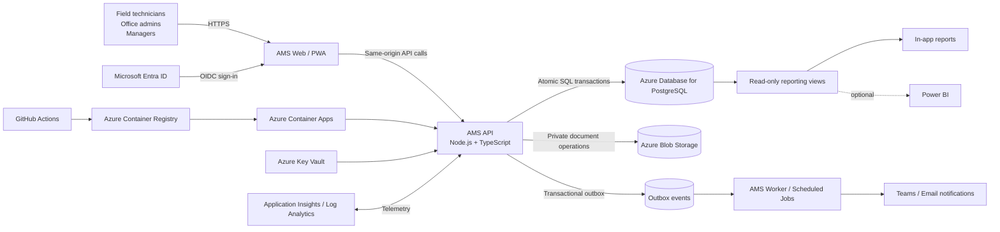

# 14 — Azure Web Application Architecture

**Decision date:** 2026-09-03  
**Status:** Target architecture approved by the System Owner; implementation and tenant verification remain pending.  
**Supersedes:** Power Apps Code App, Dataverse, and Power Automate as the primary application runtime.  
**Retains:** Microsoft Entra ID, Microsoft 365 integration where useful, the existing React user experience, the logical asset model, migration rules, domain tests, synthetic data, and the seven programme acceptance questions.

---

## 1. Decision

Englobe AMS will be delivered as a conventional internal web application rather than as a Power Apps Code App backed by Dataverse.

The application will be a mobile-first Progressive Web App (PWA) hosted in Azure. It will use Microsoft Entra ID for workforce sign-in, a server-side TypeScript API for all authoritative writes, PostgreSQL as the system of record, and private Azure Blob Storage for calibration certificates and other documents.

Microsoft 365 remains an integration surface, not the hosting or data boundary. Teams notifications and Power BI may be added where they provide value, but neither is required for the core application to operate.

This pivot removes the Power Apps runtime and Dataverse licensing dependency from the application architecture. It does not remove Azure consumption, Entra administration, support, security review, or the need for an approved enterprise hosting subscription.

---

## 2. Why the pivot is appropriate

The business requirements did not change. The implementation needs did.

The system requires:

- one atomic command for a multi-asset checkout, return, transfer, deployment, recovery, or calibration shipment;
- deterministic conflict handling when two users act on the same asset;
- a cold-start-capable offline field experience;
- explicit control over local caching and queued writes;
- a permanent append-only history;
- server-side authorization by role and office;
- private document storage;
- auditable releases and recoverable data;
- freedom to expose the application to managers without requiring a Power Apps runtime licence.

A conventional web application lets the repository own those behaviours directly. PostgreSQL transactions can validate and apply the complete business event in one commit. A service worker and IndexedDB can be designed and tested as part of the product rather than depending on undocumented host behaviour. The API can enforce role, office, transition, relationship, and idempotency rules at one authoritative boundary.

The pivot also preserves most of the useful work already completed. The existing React screens, TypeScript domain logic, tests, reference data, migration pipeline, synthetic generator, UI specification, and feature requirements remain valuable.

---

## 3. System context



### Trust boundaries

1. **Browser boundary:** The browser is not trusted to decide transitions, roles, current state, sequence values, or historical facts.
2. **API boundary:** The API validates identity, authorization, input, current database state, and the full business event.
3. **Database boundary:** PostgreSQL constraints, unique keys, row locks, and transactions protect invariants even when requests race.
4. **Document boundary:** Blob containers are private. The browser does not receive a storage account key.
5. **Notification boundary:** A notification is best-effort. Failure to send a Teams message never changes or rolls back an accepted business transaction.

---

## 4. Selected stack

### 4.1 Frontend

- Existing React + TypeScript + Vite application retained.
- Converted into an installable PWA.
- Service worker caches the application shell and approved read data.
- IndexedDB stores the permitted offline cache, drafts, and queued commands.
- Fluent UI may remain for the first production release; visual redesign is separate from the platform pivot.
- All visible strings continue to come from the string table.
- The application is designed at 390 px first and expands to tablet and desktop.

The frontend communicates only with the AMS API. `AmsBackend` remains the application seam, but its production implementation becomes HTTP rather than Dataverse.

### 4.2 Web and API runtime

- Node.js + TypeScript.
- Fastify for the HTTP API and server middleware.
- Zod or TypeBox schemas shared between request validation, OpenAPI generation, and tests.
- Kysely or equivalent typed SQL layer; important state transitions remain visible as SQL transactions rather than hidden behind opaque ORM behaviour.
- The same service serves the compiled Vite application and `/api/*` routes from one origin.
- A Backend-for-Frontend session model is used so browser authentication does not depend on long-lived API tokens stored in JavaScript-readable storage.

A future implementation plan may select equivalent maintained TypeScript libraries, but it must preserve the architectural properties above.

### 4.3 Authoritative data store

- Azure Database for PostgreSQL Flexible Server.
- Separate development, test/UAT, and production databases or servers.
- Production database reachable privately from the application environment.
- Automated backups and point-in-time recovery configured and restore-tested.
- High availability selected according to the approved RTO and budget before production.
- Schema changes managed through committed migrations.

PostgreSQL is the only authoritative business store. Reporting views, search indexes, and caches are derived from it.

### 4.4 Documents

- Azure Blob Storage, private containers.
- Certificate metadata stays in PostgreSQL.
- File bytes stay in Blob Storage.
- The API uploads, replaces, and authorizes document access.
- The application identity uses managed identity and least-privilege Blob permissions.
- Anonymous access and public containers are prohibited.
- File type, file size, naming, malware-scanning policy, retention, and replacement history are explicit requirements.

SharePoint may be used as an approved export or collaboration destination later, but it is not the certificate system of record in the target architecture.

### 4.5 Identity and authorization

- Microsoft Entra ID tenant-scoped sign-in using OpenID Connect.
- Authorization Code flow with PKCE.
- Entra app roles or approved security groups map users to application roles.
- Application roles:
  - `FieldUser`
  - `OfficeAdmin`
  - `SystemOwner`
  - `ReportReader`
- Office scope is stored and enforced by the application data model, not merely by hiding screens.
- Every write checks both role and office scope at the API.
- Managers may receive read-only access without receiving write-capable application roles.

### 4.6 Hosting

- Azure Container Apps hosts the web/API container.
- Azure Container Registry stores signed or otherwise verified deployment images.
- A separate worker container or Container Apps Job processes outbox events, reminders, overdue-return notifications, and scheduled reconciliations.
- Development, UAT, and production are isolated environments.
- Canada region is mandatory for production data and documents.
- Environment-specific configuration is injected at deployment and never committed as a secret.

### 4.7 Infrastructure and delivery

- Azure infrastructure described as code, preferably Bicep unless the enterprise platform team requires Terraform.
- GitHub Actions uses workload identity federation/OIDC to Azure; no long-lived Azure deployment secret is stored in GitHub.
- Pull requests run type checking, unit tests, migration checks, API contract tests, security checks, and production bundle scans.
- Production deployment uses immutable container revisions and a recorded rollback procedure.
- Database migration compatibility is checked before traffic is moved to a new revision.

### 4.8 Observability

- Structured JSON logs with correlation IDs.
- OpenTelemetry-compatible traces and metrics.
- Application Insights / Log Analytics as the Azure operational destination.
- Alerts for:
  - API error rate;
  - authentication failures above threshold;
  - transaction rejection spikes;
  - database connectivity failures;
  - outbox backlog age;
  - repeated offline-sync conflicts;
  - failed scheduled jobs;
  - certificate upload failures;
  - storage or database capacity thresholds.

---

## 5. Authoritative transaction design

The most important architectural change is that a complete business event is accepted and applied synchronously by one server transaction.

### 5.1 API command

```http
POST /api/transactions
Idempotency-Key: <client-generated UUID>
Content-Type: application/json
```

```json
{
  "type": "Checkout",
  "effectiveAt": "2026-09-03T13:30:00Z",
  "projectId": "...",
  "toUserId": "...",
  "expectedReturnDate": "2026-09-17",
  "primaryAssetId": "...",
  "notes": "Monitoring setup for project mobilization",
  "lines": [
    { "assetId": "...", "kitRole": "Primary" },
    { "assetId": "...", "kitRole": "Sensor1" }
  ]
}
```

The browser does **not** submit authoritative `statusBefore`, `statusAfter`, previous custodian, previous project, previous location, or sequence values.

### 5.2 Server sequence

Within one PostgreSQL transaction, the API:

1. Authenticates the caller and resolves application role and office scope.
2. Claims the idempotency key through a unique constraint.
3. Loads every affected asset using deterministic row ordering and `FOR UPDATE` locking.
4. Reconstructs or verifies current state from authoritative records.
5. Validates lifecycle, status transition, project status, custody, office scope, component rules, relationship rules, required fields, and backdating rules.
6. Refuses the whole command if any line is invalid.
7. Creates one transaction header and one immutable line per affected asset.
8. Applies all derived current-state updates.
9. Opens or closes all required kit, component, and installation spans.
10. Adds notification and audit messages to the transactional outbox.
11. Commits once.
12. Returns the stable transaction ID and resulting state for every line.

If any step fails, no line and no asset-state update is committed.

### 5.3 Concurrency and retries

- Asset rows are locked in stable ID order to reduce deadlock risk.
- Unique and check constraints provide a second layer of protection.
- The API retries a bounded set of serialization/deadlock failures.
- A repeated idempotency key returns the original result rather than recording a second event.
- A reused idempotency key with a different request hash is refused as a client defect.
- Conflict responses identify the asset, current state, current custodian where permitted, and the action the user can take.

### 5.4 F1 replacement

The normal write path no longer records lines first and waits for Power Automate F1 to derive state later.

The state-derivation logic moves into the synchronous API transaction. A scheduled reconciliation job remains valuable, but it is a detection and repair tool, not the normal authority for accepted commands.

---

## 6. Offline design

### 6.1 Supported offline experience

Once installed and successfully opened online at least once, the PWA target is:

- cold start without connectivity;
- search cached active assets;
- open cached asset details and history subset;
- prepare checkout, return, transfer, deployment, recovery, and audit drafts;
- queue allowed commands;
- keep queued commands across app restarts and device reboots;
- replay commands in order when authenticated connectivity returns;
- surface conflicts without silently dropping or overwriting work.

The exact supported browsers and managed-device configurations must be verified before pilot approval.

### 6.2 Local data rules

IndexedDB data is partitioned by:

```text
environment ID + Entra tenant ID + signed-in user object ID
```

The offline store contains only fields approved for the user’s role. Field users never cache ICCID, phone number, static IP, certificate file bytes, or other administratively secured fields.

The store records:

- schema version;
- cache generated time;
- last successful sync time;
- signed-in user identity;
- asset row version;
- queued command UUID;
- command request hash;
- replay attempts and final disposition.

On sign-out or identity change, queued commands are not replayed under the new identity. The user must either sign back into the originating account or an administrator must follow an explicit recovery process.

### 6.3 Replay model

Replay occurs when the app is active and receives an online signal, and can also be initiated manually. Browser background-sync APIs may be used as an enhancement, but they are not the only replay mechanism.

The server remains authoritative. An offline command can be rejected because the asset changed while the device was disconnected. Rejections enter **Needs attention** with enough context to resolve them.

---

## 7. Data model direction

The logical entities already specified remain, but the physical schema becomes PostgreSQL and is expanded to close known gaps.

The canonical schema is defined in `docs/15-postgres-data-model.md` and includes:

- application user and office scope;
- equipment model;
- location hierarchy;
- project;
- asset;
- asset identifier/alias;
- transaction and transaction line;
- dated asset relationship;
- calibration record and certificate;
- installation and installation component span;
- per-prefix asset ID sequence;
- idempotency record;
- transactional outbox;
- audit metadata and row versions.

Temporary tags are aliases, not mutable canonical Asset IDs.

---

## 8. Reporting

### Phase 1

Reports are regular read-only web routes backed by SQL views and API queries:

- Fleet overview
- Where / who
- Availability by office
- Calibration due and unknown
- Assets by project
- Asset timeline
- Site and installation history

Managers authenticate through Entra as `ReportReader` and do not need a Power Apps licence.

### Optional Power BI

Power BI remains optional for broader analytics. If adopted:

- it reads approved views rather than unrestricted operational tables;
- secured attributes are excluded from the manager semantic model;
- report authorization is tested independently;
- utilisation does not cross the migration boundary as though earlier history existed.

---

## 9. What is reused

The pivot is not a restart.

### Reused directly or with limited adaptation

- `app/src/features/` React screens and workflows
- Fluent UI components and the 390 px design
- `app/src/i18n/`
- state-machine data
- asset ID parsing and display logic
- point-in-time reporting logic as a reference implementation
- migration profiling, cleaning, mapping, and reports
- synthetic data requirements and generator
- UI specification
- release bundle scanning concept
- the seven acceptance questions
- feature specifications 001–008 as business requirements

### Replaced or substantially rewritten

- `api/dataverse/` becomes an HTTP backend client
- mock store persistence becomes a development-only adapter
- Dataverse schema artifacts are replaced by PostgreSQL migrations
- F1–F5 Power Automate definitions are replaced by API transaction logic, outbox workers, and scheduled jobs
- SharePoint certificate storage is replaced by Blob Storage in the target architecture
- Power Apps publishing and runtime licensing instructions are retired
- `svc-ams` becomes a managed application identity plus least-privilege worker identity

---

## 10. Repository target structure

```text
/
  app/                         React + TypeScript + Vite PWA
    src/
      api/http/                production AmsBackend implementation
      offline/                 IndexedDB cache, queue and replay
      features/
      components/
      domain/
      i18n/

  server/                      Node.js + TypeScript API and worker
    src/
      auth/
      modules/
        assets/
        transactions/
        calibration/
        installations/
        reports/
      db/
      outbox/
      documents/
      observability/

  packages/
    contracts/                 shared request/response schemas
    domain/                    shared pure domain rules where safe

  db/
    migrations/
    seeds/
    views/

  migration/                   source profiling, cleaning and production loader
  infra/                       Bicep, environment parameters, runbooks
  docs/
  specs/
```

Shared packages must not move security decisions into the browser. A shared transition table is acceptable; authoritative validation and state mutation remain server-side.

---

## 11. Environment model

| Environment | Purpose | Data |
|---|---|---|
| Local | Developer workflow | Mock or deterministic synthetic only |
| Dev | Integration and active feature development | Synthetic plus approved test records |
| UAT | Device, security, migration rehearsal and user acceptance | Sanitized rehearsal data or approved production snapshot |
| Prod | Live fleet | Production only |

Synthetic loading is structurally refused in production.

Production and non-production must have separate:

- databases;
- storage accounts or containers with independent policies;
- managed identities;
- Entra app registrations where required by policy;
- secrets and configuration;
- telemetry workspaces or clearly separated dimensions;
- deployment approvals.

---

## 12. Delivery sequence

1. Amend the constitution and record the pivot.
2. Freeze the business requirements; do not rewrite features 001–008 around technology.
3. Approve the canonical PostgreSQL schema.
4. Extract reusable frontend/domain packages.
5. Implement the API health, identity, and read paths.
6. Implement the atomic transaction command before additional write screens.
7. Replace `api/dataverse/` with `api/http/`.
8. Add the service worker, IndexedDB cache, command queue, and conflict UI.
9. Implement Blob certificate handling.
10. Implement outbox workers and scheduled jobs.
11. Bind reports to PostgreSQL views.
12. Adapt the migration loader and rehearse cutover.
13. Complete security, device, backup/restore, and load verification.
14. Run the Ottawa pilot.

The detailed sequence and definitions of done are in `docs/06-delivery-plan.md`.

---

## 13. Decisions still required

The platform pivot does not answer every product question. The following still require the System Owner or enterprise platform owner:

- final Azure subscription and resource ownership;
- Canada Central versus another approved Canadian region;
- production high-availability tier and RTO/RPO;
- whether the application is internet-reachable behind Entra or private-network-only;
- office-scoped administrator policy;
- expected-return requirement;
- transaction backdating rule;
- project master integration;
- component calibration despatch rule;
- certificate malware-scanning service and retention policy;
- exact supported mobile browsers and managed-device policy;
- whether Power BI is required after web reporting is accepted.

These decisions are explicit gates, not implementation guesses.

---

## 14. Current-source verification

Architecture choices were checked on 2026-09-03 against current primary documentation:

- Azure Container Apps overview: https://learn.microsoft.com/azure/container-apps/overview
- Azure Container Apps revisions: https://learn.microsoft.com/azure/container-apps/revisions
- Microsoft identity platform OpenID Connect: https://learn.microsoft.com/entra/identity-platform/v2-protocols-oidc
- OAuth authorization code flow with PKCE: https://learn.microsoft.com/entra/identity-platform/v2-oauth2-auth-code-flow
- Azure Database for PostgreSQL overview: https://learn.microsoft.com/azure/postgresql/overview
- PostgreSQL business continuity: https://learn.microsoft.com/azure/postgresql/backup-restore/concepts-business-continuity
- Azure Blob authorization with Entra ID: https://learn.microsoft.com/azure/storage/blobs/authorize-access-azure-active-directory
- Azure Key Vault authentication: https://learn.microsoft.com/azure/key-vault/general/authentication
- Progressive Web Apps and offline operation: https://developer.mozilla.org/docs/Web/Progressive_web_apps
- IndexedDB: https://developer.mozilla.org/docs/Web/API/IndexedDB_API

The implementation must recheck current service limits, supported regions, pricing, and enterprise policy before provisioning production resources.
